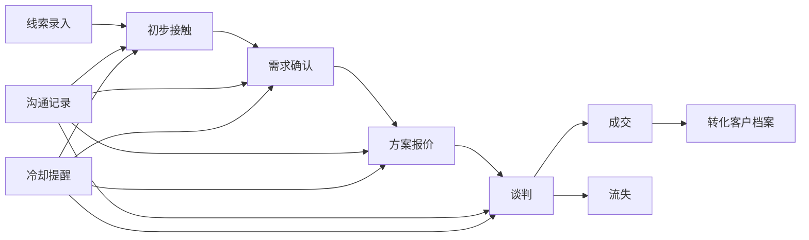
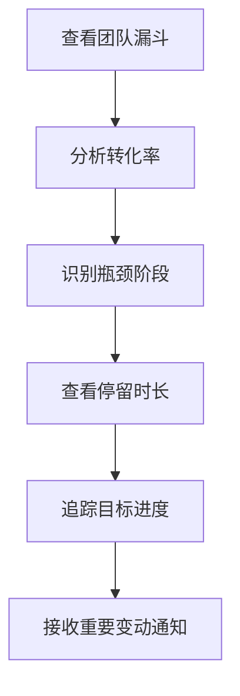

## 1. 产品概述

销售线索管理系统（CRM）是一款面向B2B销售团队的客户关系管理工具，帮助销售团队高效管理潜在客户从线索到成交的全生命周期，提升销售转化效率和团队协作能力。

- 核心价值：通过看板化管理、自动化提醒和数据分析，帮助销售团队缩短成交周期，提高线索转化率
- 目标用户：销售人员、销售经理、销售运营团队

## 2. 核心功能

### 2.1 用户角色

| 角色 | 登录方式 | 核心权限 |
|------|----------|----------|
| 销售人员 | 账号登录 | 线索录入、跟进记录、阶段推进、个人数据看板 |
| 销售经理 | 账号登录 | 全团队线索查看、漏斗分析、目标管理、通知接收 |

### 2.2 功能模块

1. **线索看板页**：五阶段看板视图、拖拽推进、冷却标记、快速筛选
2. **线索详情页**：基本信息、沟通时间线、阶段历史、转化操作
3. **客户档案页**：正式客户列表、客户详情、关联历史记录
4. **数据分析页**：漏斗转化率、阶段停留时长、成交周期分布
5. **目标管理页**：销售目标设定、月度达成进度追踪
6. **通知中心**：重要变动通知、冷却提醒、实时消息

### 2.3 页面详情

| 页面名称 | 模块名称 | 功能描述 |
|----------|----------|----------|
| 线索看板页 | 顶部导航 | 切换角色视图、搜索、筛选、新建线索按钮 |
| 线索看板页 | 五阶段看板 | 初步接触/需求确认/方案报价/谈判/成交流失，卡片式展示 |
| 线索看板页 | 线索卡片 | 客户名称、来源渠道、负责人、跟进状态、冷却标记 |
| 线索看板页 | 筛选侧边栏 | 按来源、负责人、时间范围筛选 |
| 线索详情页 | 信息概览 | 客户基本信息、来源渠道、当前阶段、负责人 |
| 线索详情页 | 沟通时间线 | 电话/邮件/拜访记录，支持手动添加和自动归档 |
| 线索详情页 | 阶段历史 | 各阶段进入/离开时间、停留时长统计 |
| 线索详情页 | 操作区 | 推进阶段、标记流失、转化客户、添加跟进 |
| 客户档案页 | 客户列表 | 已成交客户表格，支持搜索和筛选 |
| 客户档案页 | 客户详情 | 客户信息、成交历史、关联线索记录 |
| 数据分析页 | 漏斗分析 | 各阶段转化率、流失率可视化图表 |
| 数据分析页 | 时长分析 | 各阶段平均停留时长、成交周期分布图 |
| 数据分析页 | 团队排行 | 销售人员业绩排行榜 |
| 目标管理页 | 目标设定 | 月度/季度销售目标设置 |
| 目标管理页 | 进度追踪 | 达成率、缺口分析、趋势图 |
| 通知中心 | 通知列表 | 阶段推进通知、丢单通知、冷却提醒 |

## 3. 核心流程

### 3.1 线索管理主流程

销售人员录入新线索，线索进入"初步接触"阶段，通过不断沟通推进到下一阶段，最终成交或流失。成交线索可转化为正式客户档案，所有历史沟通记录一并迁移。

### 3.2 销售经理分析流程

销售经理查看全团队漏斗数据，分析各阶段转化效率，识别瓶颈环节，制定优化策略。

## 4. 用户界面设计

### 4.1 设计风格

- **主色调**：深海蓝 (#0F2A4A) 搭配活力橙 (#FF6B35)，体现专业与活力
- **辅助色**：成功绿 (#10B981)、警示红 (#EF4444)、冷却灰 (#6B7280)
- **按钮风格**：圆角矩形，微妙阴影，悬停微上浮效果
- **字体**：标题使用 "Noto Sans SC" 粗体，正文使用 "Noto Sans SC" 常规字重
- **布局风格**：卡片式布局，清晰的视觉层级，充足留白
- **图标风格**：线性图标，统一粗细，颜色与语义匹配

### 4.2 页面设计概览

| 页面名称 | 模块名称 | UI设计要点 |
|----------|----------|------------|
| 线索看板页 | 五阶段看板 | 横向滚动看板，列头显示阶段名称和数量，卡片有微妙阴影和hover效果 |
| 线索看板页 | 线索卡片 | 客户名称醒目，来源标签用不同颜色区分，冷却线索加灰色滤镜和"冷却"角标 |
| 线索详情页 | 沟通时间线 | 垂直时间线布局，不同沟通类型用不同图标和颜色，记录卡片悬浮展开 |
| 数据分析页 | 漏斗图 | 倒金字塔漏斗，各阶段用渐变填充，hover显示详细数据 |
| 目标管理页 | 进度卡片 | 环形进度条，达成率数字醒目，缺口金额红色警示 |
| 通知中心 | 通知列表 | 左侧图标区分类型，未读标记，点击跳转相关线索 |

### 4.3 响应式设计

- 桌面端优先设计（1440px基准）
- 平板端：看板改为纵向堆叠，侧边栏收起为抽屉
- 移动端：卡片列表视图，底部导航，简化操作
- 触控优化：按钮最小44px，手势支持拖拽

### 4.4 动效设计

- 页面加载：元素错落淡入，0.1s间隔
- 看板拖拽：吸附效果，占位符动画
- 阶段推进：卡片平滑过渡，成功反馈动效
- 通知弹出：右侧滑入，轻微弹跳
- 数据图表：渐进式加载，从下往上填充
