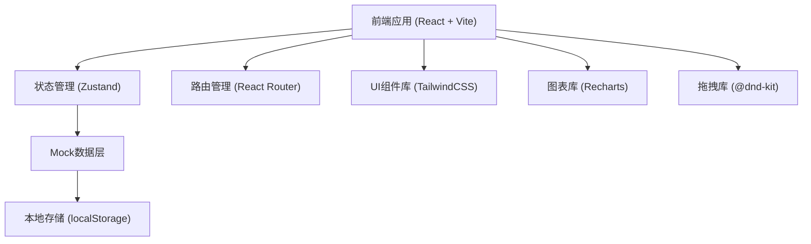
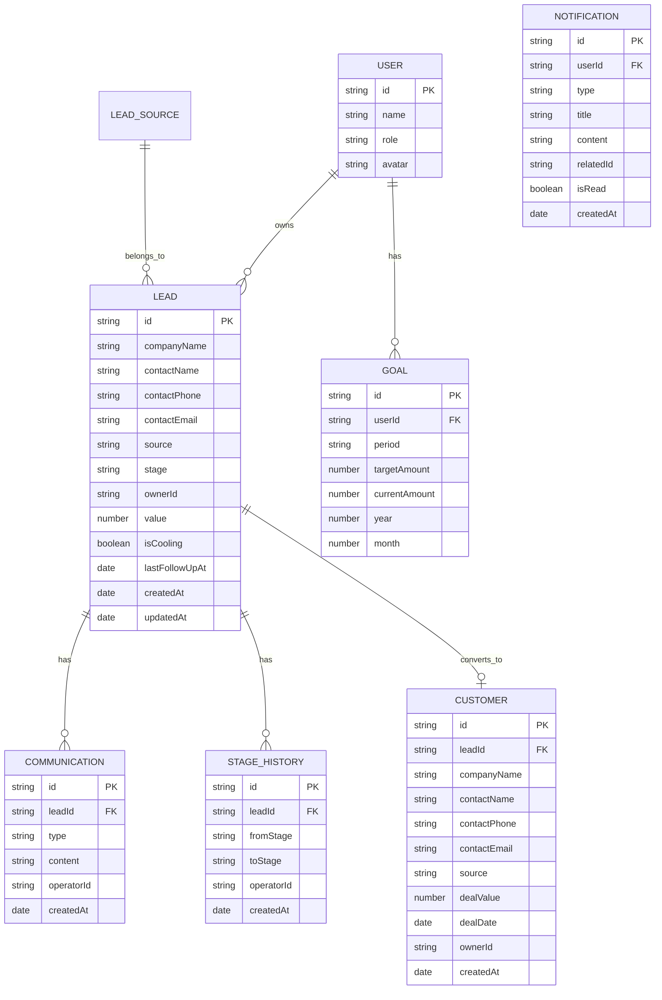

## 1. 架构设计



## 2. 技术选型

- **前端框架**：React 18 + TypeScript
- **构建工具**：Vite 5
- **样式方案**：TailwindCSS 3
- **状态管理**：Zustand
- **路由**：React Router v6
- **拖拽**：@dnd-kit/core + @dnd-kit/sortable
- **图表**：Recharts
- **图标**：Lucide React
- **日期处理**：date-fns
- **数据持久化**：localStorage + Mock数据

## 3. 路由定义

| 路由路径 | 页面名称 | 说明 |
|----------|----------|------|
| / | 线索看板页 | 首页，五阶段看板视图 |
| /lead/:id | 线索详情页 | 查看线索详情和沟通记录 |
| /customers | 客户档案页 | 已成交客户列表 |
| /customers/:id | 客户详情页 | 客户档案详情 |
| /analytics | 数据分析页 | 漏斗分析和时长统计 |
| /goals | 目标管理页 | 销售目标设定和进度 |
| /notifications | 通知中心 | 系统通知列表 |

## 4. 数据模型

### 4.1 实体关系图



### 4.2 核心类型定义

```typescript
// 线索阶段
type LeadStage = 'initial' | 'requirement' | 'proposal' | 'negotiation' | 'won' | 'lost';

// 来源渠道
type LeadSource = 'website' | 'exhibition' | 'referral';

// 沟通类型
type CommunicationType = 'call' | 'email' | 'visit';

// 用户角色
type UserRole = 'sales' | 'manager';

interface Lead {
  id: string;
  companyName: string;
  contactName: string;
  contactPhone: string;
  contactEmail: string;
  source: LeadSource;
  stage: LeadStage;
  ownerId: string;
  value: number;
  isCooling: boolean;
  coolingDays: number;
  lastFollowUpAt: string;
  createdAt: string;
  updatedAt: string;
}

interface Communication {
  id: string;
  leadId: string;
  type: CommunicationType;
  content: string;
  operatorId: string;
  operatorName: string;
  createdAt: string;
}

interface StageHistory {
  id: string;
  leadId: string;
  fromStage: LeadStage | null;
  toStage: LeadStage;
  operatorId: string;
  operatorName: string;
  createdAt: string;
  durationDays?: number;
}

interface Customer {
  id: string;
  leadId: string;
  companyName: string;
  contactName: string;
  contactPhone: string;
  contactEmail: string;
  source: LeadSource;
  dealValue: number;
  dealDate: string;
  ownerId: string;
  ownerName: string;
  createdAt: string;
}

interface User {
  id: string;
  name: string;
  role: UserRole;
  avatar: string;
}

interface Goal {
  id: string;
  userId: string;
  userName: string;
  period: 'monthly' | 'quarterly';
  targetAmount: number;
  currentAmount: number;
  year: number;
  month: number;
}

interface Notification {
  id: string;
  userId: string;
  type: 'stage_change' | 'lost' | 'cooling' | 'goal';
  title: string;
  content: string;
  relatedId: string;
  isRead: boolean;
  createdAt: string;
}

// 漏斗数据
interface FunnelData {
  stage: LeadStage;
  stageName: string;
  count: number;
  conversionRate: number;
  value: number;
}

// 阶段停留时长
interface StageDuration {
  stage: LeadStage;
  stageName: string;
  avgDays: number;
  minDays: number;
  maxDays: number;
}
```

## 5. 目录结构

```
src/
├── assets/              # 静态资源
├── components/          # 通用组件
│   ├── layout/         # 布局组件
│   ├── ui/             # UI基础组件
│   ├── lead/           # 线索相关组件
│   ├── customer/       # 客户相关组件
│   ├── analytics/      # 分析图表组件
│   └── notification/   # 通知组件
├── pages/              # 页面组件
│   ├── Board/          # 看板页
│   ├── LeadDetail/     # 线索详情页
│   ├── Customers/      # 客户档案页
│   ├── Analytics/      # 数据分析页
│   ├── Goals/          # 目标管理页
│   └── Notifications/  # 通知中心页
├── store/              # 状态管理
│   ├── useLeadStore.ts
│   ├── useUserStore.ts
│   ├── useNotificationStore.ts
│   └── useGoalStore.ts
├── types/              # 类型定义
│   └── index.ts
├── data/               # Mock数据
│   ├── leads.ts
│   ├── users.ts
│   └── customers.ts
├── utils/              # 工具函数
│   ├── date.ts
│   ├── format.ts
│   └── cooling.ts
├── hooks/              # 自定义Hooks
│   ├── useCooling.ts
│   └── useFunnel.ts
├── App.tsx
├── main.tsx
└── index.css
```

## 6. 核心功能实现要点

### 6.1 看板拖拽
- 使用 @dnd-kit 实现跨列拖拽
- 拖拽结束后触发阶段变更逻辑
- 阶段变更时记录历史和发送通知

### 6.2 冷却检测
- 自定义 Hook useCooling 检测超期未跟进线索
- 冷却阈值可配置（默认7天）
- 每日首次访问时批量检测并生成通知

### 6.3 漏斗计算
- 按阶段统计线索数量和金额
- 计算相邻阶段转化率
- 支持按时间范围和人员筛选

### 6.4 数据持久化
- 使用 localStorage 存储用户操作数据
- 初始化时加载 Mock 数据
- 关键操作即时持久化

### 6.5 通知系统
- 重要操作（阶段推进、丢单）自动生成通知
- 销售经理接收全团队通知
- 支持标记已读和全部已读
